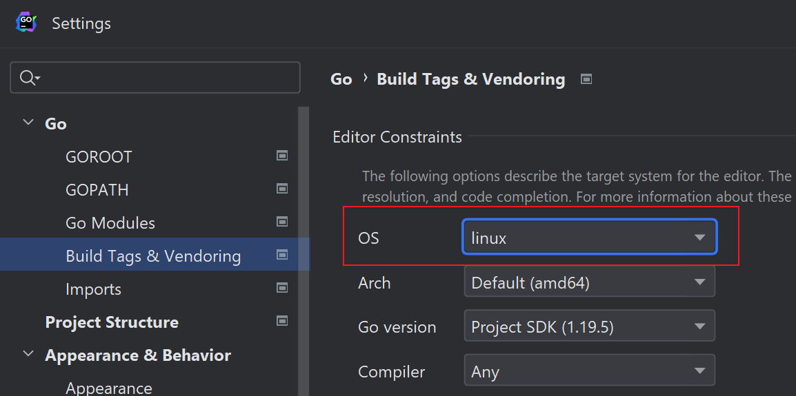

# 非原创声明

本仓库中的代码源自 [https://github.com/lizrice/containers-from-scratch](https://github.com/lizrice/containers-from-scratch) 。

本仓库中的 ubuntufs.tar 文件也是原作者在 Docker 仓库中提供的。

***

# 项目功能

用几十行Go语言代码写一个小型的容器。

***

# 改动说明

1. 原仓库的main方法中有两个分支，本仓库改成了一个，因此可以少传一个参数。
2. 原仓库没有中文注释，本仓库增加了中文注释
3. 原仓库有少数的bug，本仓库做了修复。
4. 把一些代码提取成的方法，使得结构更为清晰。
5. 原仓库的示例文件系统需要通过Docker来下载，本仓库直接提供了，避免依赖Docker。

***

# 环境要求

1. 仅支持 Linux 系统
2. 必须要用 root 用户
3. 仅在本人的 Ubuntu 18.04 和 CentOS 7 上测试过，不保证其他机型和系统能用。

***

# 使用

## 1. 安装 Go （如已安装请忽略）

```
cd /root
wget https://go.dev/dl/go1.21.3.linux-amd64.tar.gz
rm -rf /usr/local/go && tar -C /usr/local -xzf go1.21.3.linux-amd64.tar.gz
export PATH=$PATH:/usr/local/go/bin
```

如果 wget 下载太慢或超时，可以用浏览器下载，然后传到服务器上。

## 2. 准备文件系统

1. 下载本仓库中的 ubuntufs.tar 文件，这是一个作者提供的 Ubuntu 20.04 的文件系统，大小约为 72M

2. 把文件放到 /root 目录下

3. 执行以下命令，解压文件系统

```
cd /root
mkdir -p /home/liz/ubuntufs
tar xf ubuntufs.tar -C /home/liz/ubuntufs/
mkdir -p /home/liz/ubuntufs/mytemp
```

## 3. 准备 main.go 文件

1. 下载本仓库中的 main.go 文件

2. 把文件放到 /root 目录下

## 4. 执行 main.go 文件

```
cd /root
go run main.go /bin/bash
```

如果一切正常，你会看到一个 shell（注意这已经是容器中shell了），输入 exit 退出。大概长这样：

```
Running [/bin/bash] 
root@container:/#
```

***

# 如果你用 GoLand 看代码

建议把设置项 `File | Settings | Go | Build Tags & Vendoring` 改为 linux，以减少 IDE 的错误：

